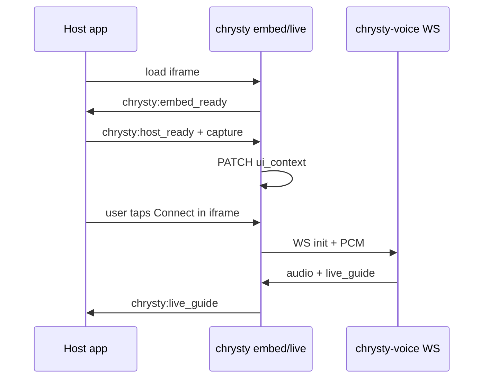

# Ask Chrysty embed — postMessage protocol

Communication between host app (`learn.chrysty.dev`) and Astra iframe (`chrysty.chrysty.dev/embed/live`).

## Security

- Validate `event.origin` — must match configured `astraEmbedUrl` origin on host; iframe validates parent is `*.chrysty.dev` or localhost dev.
- Message `type` must be one of the constants in `@chrysty/live-embed` / `src/lib/embed/post-message-bridge.ts`.

## Host → iframe

| type | payload | When |
|------|---------|------|
| `chrysty:host_ready` | `{ context, capture?, selection? }` | After iframe `chrysty:embed_ready`; includes ui context + optional JPEG base64 |
| `chrysty:context_update` | `{ context }` | Page navigation while overlay open |
| `chrysty:capture_update` | `{ capture, selection? }` | User refreshed screen capture |

### context shape (maps to explanation_canvas ui_context)

```typescript
{
  title: string;
  selected_passage?: string;
  nearby_excerpt?: string;
  artifact_language?: string;
  worker?: string;
  entity_id?: string;
}
```

### capture shape

```typescript
{
  base64: string;
  mimeType: 'image/jpeg';
  width: number;
  height: number;
  focusAnnotations?: FocusAnnotation[];
}
```

## iframe → host

| type | payload | When |
|------|---------|------|
| `chrysty:embed_ready` | `{ sessionId? }` | Embed shell mounted |
| `chrysty:connected` | `{}` | Live WS connected |
| `chrysty:speaking` | `{ speaking: boolean }` | Model audio state |
| `chrysty:live_guide` | `LiveGuideUpdate` | Forward circles/paths to draw on host page |
| `chrysty:closed` | `{}` | User ended Live session |

## Sequence


